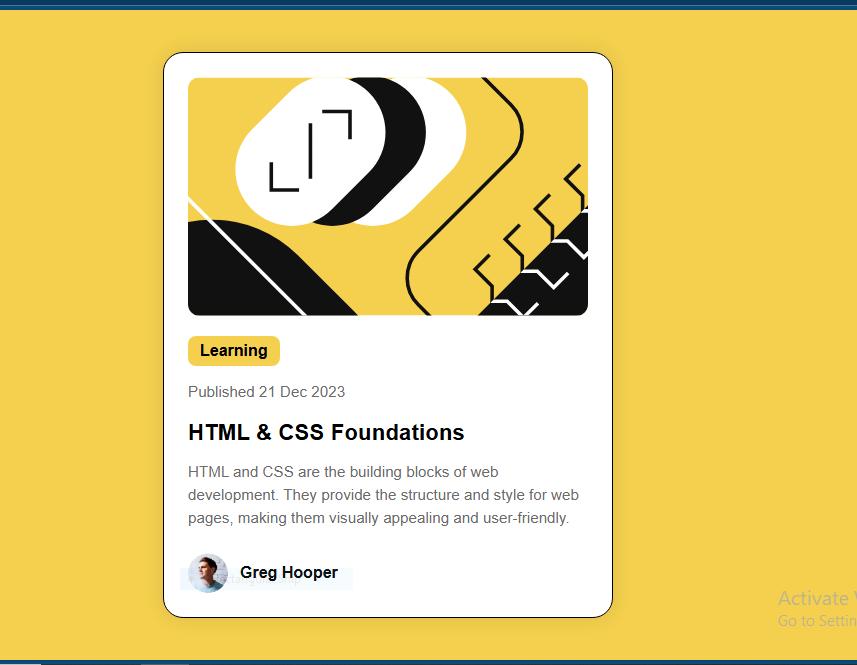

# Frontend Mentor - Blog Preview Card



## 👋 Welcome

Thanks for checking out my solution to the [Frontend Mentor Blog Preview Card Challenge](https://www.frontendmentor.io/challenges/blog-preview-card-ckPaj01IcS).

This was a fun and practical challenge that helped me improve my HTML and CSS fundamentals while building a clean and responsive UI component.

---

## 🧠 The Challenge

Users should be able to:

- See hover and focus states for all interactive elements
- View the layout responsively on mobile and desktop

---

## 📸 Screenshot

> Add your screenshot below:

)

---

## 🔗 Links

- Live Site URL: [https://your-live-site-link.com](https://your-live-site-link.com)
- Solution Repo: [https://github.com/muskan-fatim/blog-preview-card](https://github.com/muskan-fatim/blog-preview-card)

---

## ⚙️ Built With

- Semantic **HTML5**
- Modern **CSS** (Flexbox, media queries)
- Mobile-first responsive design
- Basic accessibility practices

---

## 📚 What I Learned

In this challenge, I learned:

- How to center a card both vertically and horizontally using Flexbox:
  ```css
  display: flex;
  justify-content: center;
  align-items: center;
  height: 100vh;
  ```
- Using `max-width` and `width: 100%` for responsive components
- Organizing content and making it visually clean with padding, margin, and border-radius
- Adding hover/focus states for better user experience

---

## 🚧 Continued Development

In future projects, I want to:

- Explore `grid` layouts alongside Flexbox
- Improve on consistent spacing and typography across breakpoints
- Use `rem`/`em` units instead of fixed pixels more often

---

## ✍️ Author

- Frontend Mentor – [@yourusername](https://www.frontendmentor.io/profile/muskan-fatim)

---

## 🙌 Acknowledgments

Thanks to Frontend Mentor for providing amazing challenges that help improve real-world web development skills.

